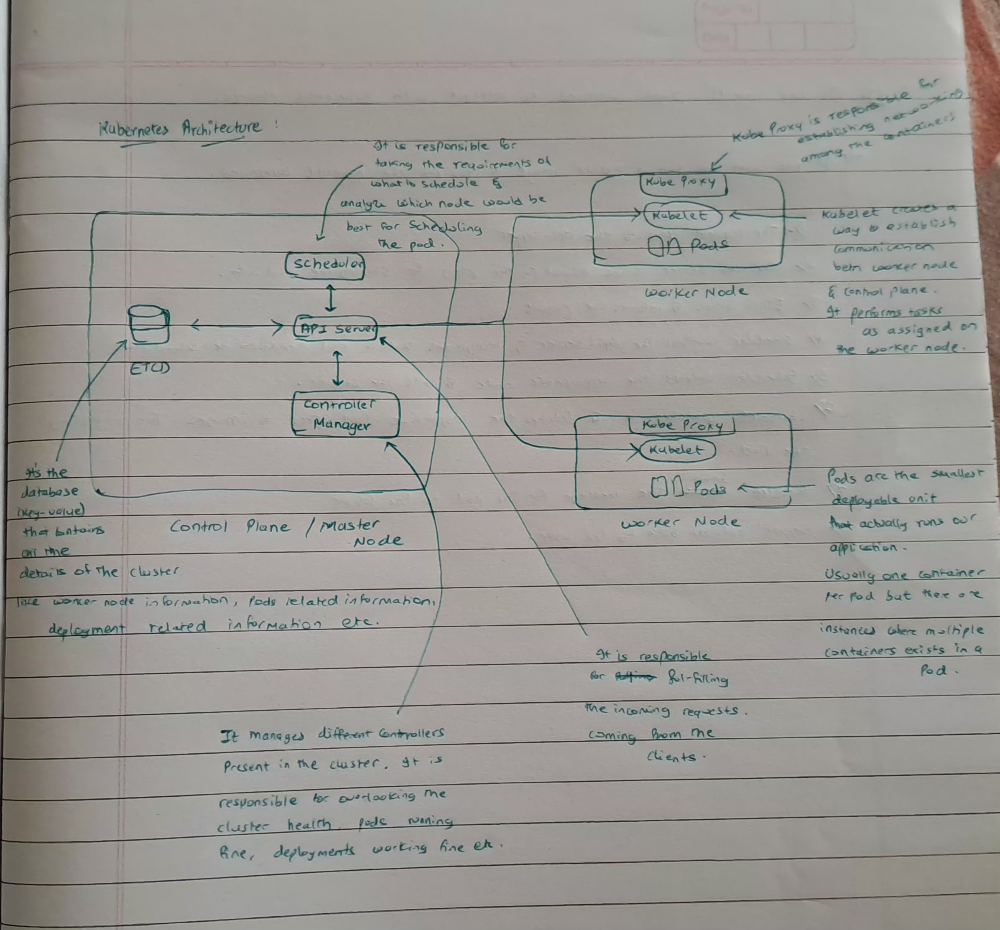

# Day 01 - Kubernetes Architecture

## What I Did Today

Today was all about understanding how Kubernetes is structured before touching any commands. I focused on the two main parts of a Kubernetes cluster: the Control Plane and the Worker Nodes, and then walked through how these components talk to each other when you run a simple command.

---

## The Control Plane (Master Node)

The Control Plane is the brain of the cluster. It makes decisions, stores state, and keeps everything running as intended. It consists of four key components.

### API Server

The front door to the entire cluster. Every request from a client, whether it is a `kubectl` command, a CI pipeline, or an internal component, hits the API server first. It authenticates and validates the request before doing anything with it, then coordinates with other components to fulfill it.

### etcd

A distributed key-value store that acts as the cluster's database. It stores the current state of everything in the cluster: worker node information, pod specs, deployment details, and more. If etcd goes down, the cluster loses its memory of what should be running. It is the single source of truth.

### Scheduler

Responsible for deciding which worker node a new pod should run on. When a pod needs to be placed, the scheduler looks at the available nodes, checks their available CPU, memory, and capacity, and picks the best fit. It does not run the pod itself, it just decides where it should go.

### Controller Manager

Manages a collection of controllers that handle specific responsibilities inside the cluster. The replica controller, deployment controller, and others all run under the controller manager. Each controller continuously watches the cluster state and works to bring actual state in line with desired state.

---

## Worker Nodes

Worker nodes are where the actual workloads run. Each node has two core components running on it.

### Kubelet

The agent that runs on every worker node and acts as the node's point of contact with the API server. Kubelet watches the API server for pod specs assigned to its node, then pulls the required container images and starts the pods. Once pods are running, it keeps reporting their status back to the API server.

### Kube-Proxy

A network proxy running on every worker node that implements part of the Kubernetes Service concept. It maintains the network rules that allow pods to receive traffic from inside or outside the cluster.

---

## Pods

A pod is the smallest deployable unit in Kubernetes. A pod usually contains a single container, but it can hold more than one. A common example is a logging container running alongside the main application container to capture its logs.

When multiple containers share a pod, they share the same network namespace and lifecycle: they scale together, restart together, and get destroyed together. This means you should be deliberate about which containers belong in the same pod and which should be separate.

---

## How It All Fits Together: Running an nginx Pod

To make the architecture concrete, here is what happens step by step when you run:

```bash
kubectl run nginx-pod --image=nginx:latest
```

1. The request hits the **API server**, which authenticates and validates it.
2. The API server writes the new pod's desired state to **etcd**.
3. The **scheduler**, which watches the API server, detects that a pod needs to be placed. It picks a suitable node based on available resources and reports back to the API server.
4. The **kubelet** on the chosen node, also watching the API server, picks up the pod spec assigned to it.
5. Kubelet pulls the `nginx:latest` image and starts the container.
6. Kubelet reports the pod status back to the API server, which updates etcd.
7. The API server returns the response to the client.

Note: both the scheduler and kubelet use watcher streams against the API server so they react to changes as they happen rather than polling on an interval.



---
