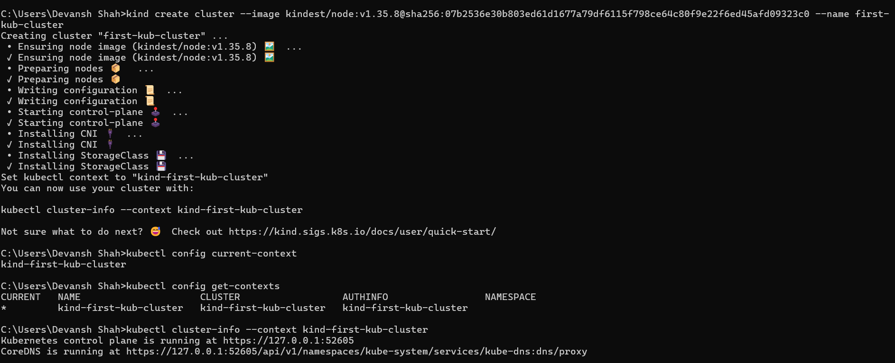
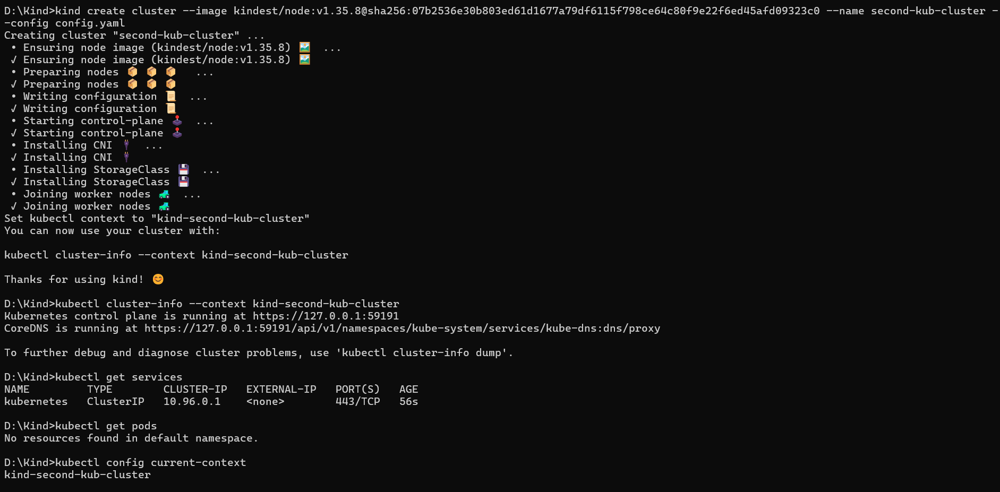
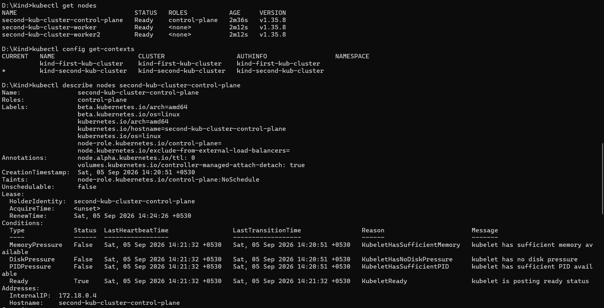

# Day 02 - Hands-On with kubectl and KinD

## What I Did Today

This was my first hands-on day with Kubernetes. Instead of just reading theory, I started running actual commands to see what the output looks like and understand when to use what. I used KinD (Kubernetes in Docker) as my local cluster environment throughout this session.

---

## Understanding kubectl Context

Before running any commands, I got curious about something I kept seeing in the docs: **context**. So I looked it up first.

### What is a Context?

A kubectl context is a group of access parameters that tells kubectl:

- Which **cluster** to talk to (in a multi-cluster environment, there are different clusters so setting context lets the kubectl know which cluster to talk to)
- Which **user credentials** to use
- Which **namespace** to target by default


### Core Components of a Context


| Component     | What it Represents                                                                        |
| ------------- | ----------------------------------------------------------------------------------------- |
| **Cluster**   | The API server URL and security certificate for the target Kubernetes environment         |
| **User**      | The credentials, tokens, or certificates used to authenticate your identity               |
| **Namespace** | The default virtual workspace where commands execute if you do not specify one explicitly |


### Why Contexts Are Useful

**Avoid Repetition:** You do not need to type the cluster endpoint, user credentials, or namespace flags every time you run a command.

**Multi-Cluster Management:** They let you safely switch between different environments like development, staging, and production using a single short command.

---


## Commands I Explored


### Creating a KinD Cluster

```bash
kind create cluster \
  --image kindest/node:v1.35.8@sha256:07b2536e30b803ed61d1677a79df6115f798ce64c80f9e22f6ed45afd09323c0 \
  --name first_kub_cluster
```

The `--image` flag pins the cluster to a specific Kubernetes version. The `--name` flag gives the cluster a recognizable name instead of the default `kind`.

---


### Working with Contexts

```bash
# Check which context you are currently using
kubectl config current-context

# List all available contexts across clusters
kubectl config get-contexts

# Switch to a different context
kubectl config use-context my-cluster-name
```

---


### Getting Cluster Information

```bash
# Get details about a specific cluster by passing its context name
kubectl cluster-info --context kind-second-kub-cluster
```

---


### Exploring Nodes and Pods

```bash
# List all nodes in the current cluster
kubectl get nodes

# List all running pods in the current namespace
kubectl get pods

# Describe a specific node (replace with actual node name)
kubectl describe nodes <node-name>

# Describe a specific pod (replace with actual pod name)
kubectl describe pods <pod-name>
```

`describe` is particularly useful when something is not working as expected. It gives you detailed information including events, which is usually where the error messages show up.

---


### Command Outputs

Cluster Information: 


Current Context:


Describe Node:


---


## Why KinD is Not Suitable for Production

After getting comfortable with commands, I got curious about the limitations of KinD and why it is not used in production environments.


| Feature                     | KinD Architecture                                                           | Production Requirement                                                          |
| --------------------------- | --------------------------------------------------------------------------- | ------------------------------------------------------------------------------- |
| **Infrastructure**          | Nodes run as Docker containers on a single host OS                          | Nodes run on separate VMs or bare-metal servers                                 |
| **Single Point of Failure** | If the host machine or Docker daemon crashes, the entire cluster goes down  | High availability distributed across multiple cloud zones or physical hardware  |
| **Security**                | Nodes require privileged containers, weakening the host's security boundary | Strict isolation and least-privilege access across all infrastructure           |
| **Storage and Networking**  | Uses transient local storage and port-mapping bound to the host             | Integration with cloud block storage, enterprise SANs, and cloud load balancers |
| **Resource Contention**     | All master and worker nodes compete for the same host CPU and RAM           | Dedicated resource allocation per node to prevent noisy neighbor issues         |


---


## Where KinD Actually Shines

Even though KinD is not for production, it is widely used in professional engineering workflows:

**CI/CD Automation:** Because KinD clusters can be spun up, tested against, and destroyed in seconds, tools like GitHub Actions, GitLab CI, and Jenkins use it to run automated integration tests against Kubernetes manifests and applications.

**Local Development:** Developers use it to mimic a multi-node Kubernetes cluster on their laptops without the heavy resource overhead of full virtualization.

---